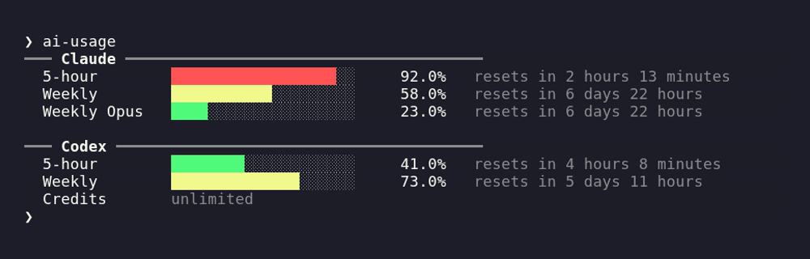

# ai-usage

Claude and Codex subscription usage in the terminal. One command, no new
session, no `curl | jq | python3` pipeline.



Each window is a 20-character bar (one block per 5%) with its utilization and the
time until it resets. On a terminal the bar is colored by how full it is (green,
then yellow, then red), and falls back to plain text when piped or under
`NO_COLOR`. Windows with no data are dropped.

## Install

Run it without installing:

```
nix run github:ilyasturki/ai-usage
```

Add it to a Nix config:

```nix
inputs.ai-usage.url = "github:ilyasturki/ai-usage";
# ...
home.packages = [ inputs.ai-usage.packages.${system}.default ];
```

Or build from source. Standard library only, nothing to vendor:

```
go build -o ai-usage .
```

## Usage

```
ai-usage          combined Claude + Codex view (default)
ai-usage claude   Claude usage only
ai-usage codex    Codex usage only
```

Exit status is non-zero when the usage you asked for couldn't be fetched. In
combined mode that means both providers failed, so it scripts cleanly.

## How it reads usage

- **Claude** reuses the OAuth token Claude Code stores in
  `~/.claude/.credentials.json` and calls the same `oauth/usage` endpoint the
  `/usage` command hits. It never refreshes the token. When it's stale (401) you
  get a clear "open Claude once to refresh" message.
- **Codex** reads the rate-limit snapshots Codex already writes to its session
  logs under `~/.codex/sessions` (honoring `$CODEX_HOME`), newest file first, so
  checking usage doesn't start a session of its own. Only the tail of each log is
  scanned, so it stays fast even when sessions grow to hundreds of MB. The
  snapshot is a point in time: a window whose reset already passed reads `0.0%`
  (it rolled over, and no newer usage means no newer snapshot), so an idle Codex
  shows empty windows instead of a stale percentage.

Both upstreams are undocumented and shift between releases. This tool trades
clear errors and a fast test loop for that, not immunity.

## License

MIT
